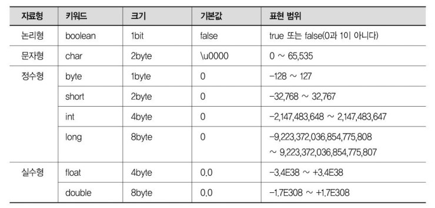
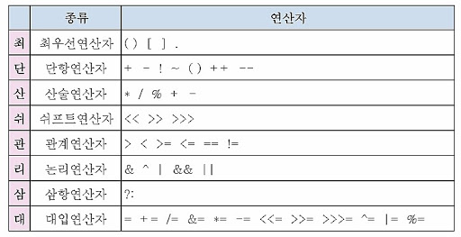

# Java기초-자료형,연산자

생성일: 2023년 3월 29일 오전 9:09

### 1. 자료형(Data Type)

- 기본형 : 실제 값이 메모리에 저장됨 & 표현 범위를 벗어나지 않음



- 참조형 : 주소값이 메모리에 저장되고 기본형을 제외한 모든 자료형 대표적으로 String이 있음
    - String

### 2. 기본 구문

**package > class > method > field**

```java
package ex01;

public class Hello{
	public static void main(String[] args){
		System.out.println("Hello world!");
	}
}
```

**출력 구문**

```java
print()  - 개행없이 출력 
println() - 출력 및 개행
printf() - 포맷에 맞춰서 출력 : %문자 - %c, %s, %d, %i, %f,...
```

### 3. 연산자(Operator)

<aside>
💡 우선순위가 있다! 최단산쉬관논삼대콤 
                            높<—               —>낮

</aside>



### 4. 입력(Scanner Class)

```java
import java.util.Scanner;  // Ctr + Shift + O 자동 Import 단축키

public class Main{
	public static void main(String[] args){
		// 표준 입출력: System.in 		
		Scanner sc = new Scanner(System.in);//1. 객체생성, 메모리할당, 생성자함수 자동호출
		
		System.out.println("정수를 입력해주세요:");
		// nextXXX next(), nextInt(), nextFloat(), nextDouble()...
		int x = sc.nextInt(); // 변수에 값 대입
		
		System.out.println("\n입력된 값은: " + x); // 변수 출력
	}
}
```